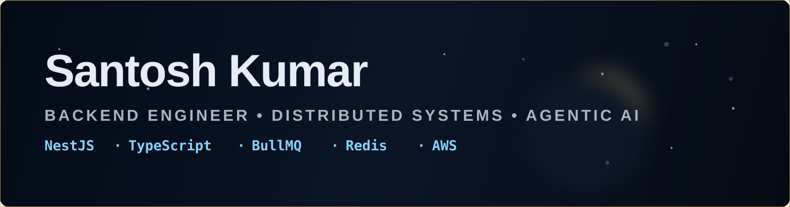

  
  
  
  

---

## `> whoami`

Backend engineer with production experience shipping **event-driven systems** on NestJS, TypeScript, MongoDB, Redis, BullMQ and AWS. I also build **AI agents** on the side.

- 🚀 **Shipped:** [CAConnect](https://www.bevritti.in) (practice management for Indian CA firms) and [20fourr](https://20fourr.com) (marketplace for PSARA-licensed security)
- 💼 **Now:** Backend at Indorse Technologies. OTP/email verification, Razorpay payments, BullMQ webhook processing
- 🔭 **Building:** AI SRE, an event-driven system for incident detection, diagnosis and resolution
- 🤝 **Open source:** merged PRs in [AsyncAPI](https://github.com/asyncapi)
- 🏆 **LeetCode:** Knight · Top 4% globally · 2300+ problems solved
- ✍️ **Writing:** [santosh15.hashnode.dev](https://santosh15.hashnode.dev/)

  

---

## 🚀 Production & Products

| Product | What it does | Links |
|--------|--------------|-------|
| **CAConnect by Bevritti** | Practice management for Indian CA firms: compliance calendar, GST 2B reconciliation, TDS checks, AI-drafted notice replies, fee register | [bevritti.in](https://www.bevritti.in) |
| **20fourr** | Two-sided marketplace to book PSARA-licensed guards, bouncers, gunmen and PSOs | [Web](https://20fourr.com) · [Client](https://client.20fourr.com) · [Provider](https://provider.20fourr.com) · [Android client](https://play.google.com/store/apps/details?id=com.twentyfourr.client) · [Android provider](https://play.google.com/store/apps/details?id=com.secureconnect.provider) |
| Payments & verification backend | OTP/email verification and Razorpay payments with MSG91 and BullMQ webhook processing | Indorse Technologies |
| Payout processor | Idempotent settlement flows with India tax compliance (TDS 194C, GST, TCS) | — |
| Async notification pipeline | Re-architected an AWS SQS notification pipeline for a language-learning app | — |
| Distributed logging | NestJS microservices logging with correlation-ID propagation and a log explorer dashboard | — |

---

## ⚙️ Backend & Distributed Systems

| Project | Description | Stack |
|--------|-------------|-------|
| [🏘️ Airbnb Clone](https://github.com/kumarsantosh3914/airbnb-dev) | Microservices backend: booking, listings, auth, notifications, Redis Redlock | `Go` `TypeScript` |
| [🟨 LeetCode Backend](https://github.com/kumarsantosh3914/leetcode-backend) | Code submission and judging system with async job queues and isolated execution | `Node.js` `Kafka` `Docker` |
| [🗄️ DB Sharding & Replication](https://github.com/kumarsantosh3914/mysql-replication-sharding-demo) | Master-slave replication and sharding | `Docker` `MySQL` `ProxySQL` |
| [⚖️ Custom Load Balancer](https://github.com/kumarsantosh3914/basic-load-balancer) | Layer 7 load balancer from scratch (Round-Robin, Least-Connection) | `Go` |
| [🛡️ Microservices Resilience](https://github.com/kumarsantosh3914/CircuitBreakers) | Circuit Breaker pattern preventing cascading failures | `TypeScript` |
| [✈️ Airline Management System](https://github.com/kumarsantosh3914/AirlineBackendManagementProject) | Flight search, booking and seat management | `Node.js` `MySQL` |
| [🐦 GoTwitter](https://github.com/kumarsantosh3914/GoTwitter) | Twitter-like backend: tweets, follows, feeds | `Go` `PostgreSQL` |

---

## 🤖 Agentic AI & LLM Engineering

| Project | Description | Stack |
|--------|-------------|-------|
| [🧠 CrewAI Engineering Team](https://github.com/kumarsantosh3914/crewai-engineering-team) | Multi-agent collaboration for dev workflows | `CrewAI` |
| [🔍 Deep Research Agent](https://github.com/kumarsantosh3914/deep-research-agent) | Multi-step research across sources | `LangGraph` |
| [💹 Finance Research Agent](https://github.com/kumarsantosh3914/finance-research-agent) | Financial research with tool-calling and web reasoning | `LangChain` |
| [📈 Trending Stock Picker](https://github.com/kumarsantosh3914/trending-stock-picker-agent) | Analyzes market signals to surface trending stocks | `LLM` |
| [💼 Jobs Search & Apply Agent](https://github.com/kumarsantosh3914/jobs-search-apply-agent) | Searches jobs, tailors applications and applies | `LangChain` |
| [🎓 Course Instructor Agent](https://github.com/kumarsantosh3914/course-instructor-agent) | Structures, teaches and evaluates course content | `CrewAI` |
| [🚀 LangGraph Agent Starter](https://github.com/kumarsantosh3914/langgraph-agent-starter) | Starter template for stateful agents | `LangGraph` |

---

## 📚 Low-Level Design

[BookMyShow](https://github.com/kumarsantosh3914/Bookmyshow-LLD) ·
[Splitwise](https://github.com/kumarsantosh3914/LLD-SplitWise) ·
[Stock Exchange](https://github.com/kumarsantosh3914/StockExchangeMachineCoding) ·
[Chess](https://github.com/kumarsantosh3914/ChessGameLLD) ·
[Design Patterns](https://github.com/kumarsantosh3914/design-pattern-LLD)

---

## 🐍 Contribution Snake

  <picture>
    <source media="(prefers-color-scheme: dark)" srcset="https://raw.githubusercontent.com/kumarsantosh3914/kumarsantosh3914/output/github-snake-dark.svg" />
    <source media="(prefers-color-scheme: light)" srcset="https://raw.githubusercontent.com/kumarsantosh3914/kumarsantosh3914/output/github-snake.svg" />
    
  </picture>

---

## 🌐 Find Me

